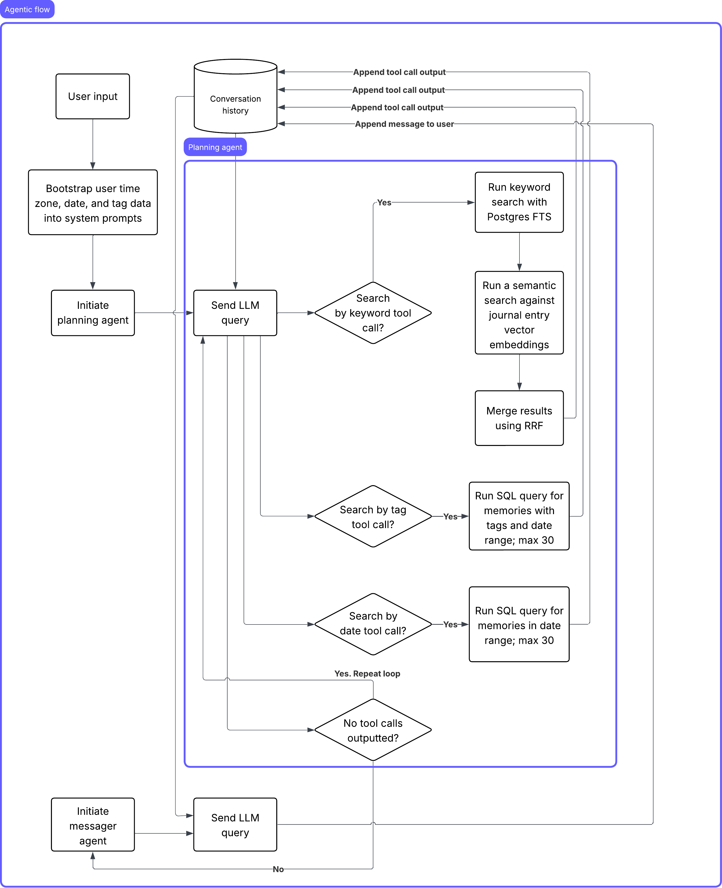

# Memento AI

**Live Demo:** [memento-ai.vercel.app](https://memento-ai.vercel.app)

An AI-powered personal journaling app that uses semantic memory search and a multi-agent conversational AI to help you reflect on your life. Write journal entries, tag and organize them, search through your memories with natural language, and chat with an AI companion that actually understands your history.

> **Warning:** This project is not production-ready. User data is **not** encrypted at rest and there are no privacy guarantees. Use at your own risk.

## Features

- **Journal Entries** — Write, edit, and delete entries. Each entry is automatically embedded as a 1536-dimensional vector for semantic search.
- **Color-Coded Tags** — Organize entries with tags from a 36-color palette. Filter your journal by tag.
- **Hybrid Semantic Search** — Combines vector similarity (pgvector) with full-text keyword matching. Supports multiple parallel queries, date range filtering, and relevance scoring.
- **AI Chat Companion** — A two-agent system (Planner + Messenger) that retrieves relevant journal entries via tool calls and synthesizes warm, contextual responses grounded in your actual memories.
- **Authentication** — Email/password auth via Supabase with per-user data isolation.

## Tech Stack

| Layer          | Technology                                     |
| -------------- | ---------------------------------------------- |
| Framework      | Next.js 16 (App Router)                        |
| Language       | TypeScript                                     |
| Styling        | Tailwind CSS 4                                 |
| Database       | PostgreSQL (Supabase) with pgvector            |
| Auth           | Supabase Auth                                  |
| Edge Functions | Supabase Edge Functions (Deno)                 |
| LLM            | OpenRouter API (Gemini 2.0 Flash default)      |
| Embeddings     | OpenAI `text-embedding-3-small` via OpenRouter |
| Deployment     | Vercel                                         |

## Architecture

### Two-Agent Chat System



When a user sends a message, it flows through two specialized agents:

1. **Planner Agent** — Analyzes the user's message and decides what journal entries to retrieve. It has access to three tools:
    - `search_by_keyword` — Semantic + keyword hybrid search
    - `search_by_tag` — Filter entries by tag IDs
    - `search_by_date` — List entries within a date range

    The planner can call tools iteratively (up to 5 rounds) until it has enough context.

2. **Messenger Agent** — Receives the planner's retrieved context along with the user's message and generates a warm, grounded response. It has no tool access — it only synthesizes.

### Hybrid Search

Search queries hit a PostgreSQL RPC function (`hybrid_memory_search`) that combines:

- **Vector similarity** — Cosine distance between the query embedding and stored entry embeddings (pgvector)
- **Full-text search** — PostgreSQL `tsvector`/`tsquery` lexical matching

Results are ranked by a combined relevance score.

## Getting Started

### Prerequisites

- Node.js 18+
- A [Supabase](https://supabase.com) project with the pgvector extension enabled
- [OpenRouter](https://openrouter.ai) API keys (one for chat models, one for embeddings)

### Setup

1. Clone the repo:

    ```bash
    git clone https://github.com/your-username/memento-ai.git
    cd memento-ai/memento-ai
    ```

2. Install dependencies:

    ```bash
    npm install
    ```

3. Create a `.env.local` file in the `memento-ai/` directory:

    ```env
    USE_LOCAL="false"

    NEXT_PUBLIC_SUPABASE_URL=your_supabase_project_url
    NEXT_PUBLIC_SUPABASE_ANON_KEY=your_supabase_anon_key
    SUPABASE_SERVICE_ROLE_KEY=your_supabase_service_role_key

    OPENROUTER_API_KEY=your_openrouter_api_key
    OPENROUTER_OPENAI_EMBEDDINGS_KEY=your_openrouter_embeddings_key
    ```

4. Set up your Supabase database:
    - Enable the `vector` extension (`CREATE EXTENSION IF NOT EXISTS vector;`)
    - Run the migrations in `supabase/migrations/`
    - Create the `hybrid_memory_search` RPC function (see migrations)

5. Start the dev server:

    ```bash
    npm run dev
    ```

    The app runs at `http://localhost:3000`.

### Available Scripts

| Command         | Description              |
| --------------- | ------------------------ |
| `npm run dev`   | Start development server |
| `npm run build` | Production build         |
| `npm start`     | Start production server  |
| `npm run lint`  | Run ESLint               |

## API Endpoints

| Method   | Endpoint                          | Description                        |
| -------- | --------------------------------- | ---------------------------------- |
| `POST`   | `/api/auth/signin`                | Sign in                            |
| `POST`   | `/api/auth/signup`                | Create account                     |
| `POST`   | `/api/auth/signout`               | Sign out                           |
| `GET`    | `/api/memories?limit=50&offset=0` | Fetch journal entries (paginated)  |
| `POST`   | `/api/memories`                   | Create entry (generates embedding) |
| `PUT`    | `/api/memories/[id]`              | Update entry                       |
| `DELETE` | `/api/memories/[id]`              | Delete entry                       |
| `GET`    | `/api/tags`                       | Fetch user's tags                  |
| `POST`   | `/api/tags`                       | Create tag                         |
| `PUT`    | `/api/tags/[id]`                  | Update tag                         |
| `DELETE` | `/api/tags/[id]`                  | Delete tag                         |
| `POST`   | `/api/search/keyword`             | Semantic hybrid search             |
| `POST`   | `/api/search/tag`                 | Filter by tags                     |
| `GET`    | `/api/chat?conversationId=uuid`   | Fetch conversation                 |
| `POST`   | `/api/chat`                       | Save message                       |
| `POST`   | `/api/chat/planner`               | Planner agent (with tools)         |
| `POST`   | `/api/chat/messenger`             | Messenger agent                    |

## Security Notice

This is a personal/demo project. The following are **not** implemented:

- End-to-end encryption
- Data encryption at rest
- Audit logging
- Rate limiting
- Privacy policy / GDPR compliance

Supabase Row Level Security (RLS) policies enforce per-user data isolation, but this should not be considered sufficient for sensitive data in a production environment.

## License

This project is licensed under [The Unlicense](https://unlicense.org/).

This is free and unencumbered software released into the public domain. Anyone is free to copy, modify, publish, use, compile, sell, or distribute this software, either in source code form or as a compiled binary, for any purpose, commercial or non-commercial, and by any means.

See the [UNLICENSE](UNLICENSE) file for the full text.
